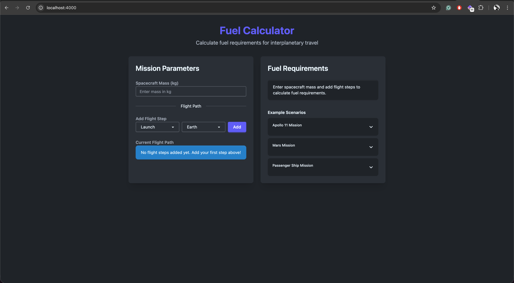

# NASA Fuel Calculator 🚀

An advanced web application built with Elixir, Phoenix, and LiveView that calculates the required fuel for interplanetary travel. This application allows users to dynamically build flight paths and calculate fuel requirements for missions involving Earth, Moon, and Mars.

## Demo

### Screenshot



### Video Walkthrough

📹 [Click here to watch the application demo video](./fuel_calculator_app_recording.mov)

## Features

- **Real-time Fuel Calculations**: Uses Phoenix LiveView for instant feedback as users modify their mission parameters
- **Dynamic Flight Path Builder**: Add, remove, and reorder flight steps (launch/land) for different planets
- **Accurate Physics**: Implements NASA-grade fuel calculation formulas accounting for gravity and fuel weight
- **Responsive UI**: Built with Tailwind CSS and DaisyUI for a modern, user-friendly interface
- **Comprehensive Testing**: Full test coverage for all critical calculation logic

## Fuel Calculation Logic

The application calculates fuel requirements using the following formulas:

- **Launch**: `mass * gravity * 0.042 - 33` (rounded down)
- **Landing**: `mass * gravity * 0.033 - 42` (rounded down)

The calculator accounts for the weight of fuel itself, recursively calculating additional fuel needed until the additional fuel requirement is zero or negative.

### Supported Planets

- **Earth**: gravity = 9.807 m/s²
- **Moon**: gravity = 1.62 m/s²
- **Mars**: gravity = 3.711 m/s²

## Example Scenarios

### Apollo 11 Mission
- **Path**: Launch Earth → Land Moon → Launch Moon → Land Earth
- **Equipment mass**: 28,801 kg
- **Total fuel required**: 51,898 kg

### Mars Mission
- **Path**: Launch Earth → Land Mars → Launch Mars → Land Earth
- **Equipment mass**: 14,606 kg
- **Total fuel required**: 33,388 kg

### Passenger Ship Mission
- **Path**: Launch Earth → Land Moon → Launch Moon → Land Mars → Launch Mars → Land Earth
- **Equipment mass**: 75,432 kg
- **Total fuel required**: 212,161 kg

## Getting Started

### Prerequisites

- Elixir 1.15 or later
- Phoenix 1.8
- Node.js (for asset compilation)

### Installation

1. Clone the repository
2. Install dependencies:
   ```bash
   mix setup
   ```

3. Start the Phoenix server:
   ```bash
   mix phx.server
   ```

4. Visit [`localhost:4000`](http://localhost:4000) from your browser

### Running Tests

Run the comprehensive test suite:

```bash
mix test
```

For pre-commit checks (compile, format, and test):

```bash
mix precommit
```

## Architecture

### Project Structure

- **`lib/fuel_calculator/fuel_calculation.ex`**: Core business logic context containing all fuel calculation functions
- **`lib/fuel_calculator_web/live/fuel_calculator_live.ex`**: Phoenix LiveView module handling UI interactions and real-time updates
- **`test/fuel_calculator/fuel_calculation_test.exs`**: Comprehensive test suite covering all calculation scenarios

### Design Principles

- **Functional Core, Imperative Shell**: Business logic is pure and testable in the Context module
- **Pattern Matching**: Extensive use of Elixir's pattern matching for clarity and correctness
- **Immutability**: All data transformations follow functional programming principles
- **Real-time Updates**: LiveView provides instant feedback without page reloads

## Technical Stack

- **Backend**: Elixir 1.15 with OTP
- **Web Framework**: Phoenix 1.8
- **Real-time**: Phoenix LiveView 1.1
- **Styling**: Tailwind CSS v4 with DaisyUI
- **Testing**: ExUnit with comprehensive coverage

## License

This project was created as a coding challenge demonstration.

## Learn More About Phoenix

* Official website: https://www.phoenixframework.org/
* Guides: https://hexdocs.pm/phoenix/overview.html
* Docs: https://hexdocs.pm/phoenix
* Forum: https://elixirforum.com/c/phoenix-forum
* Source: https://github.com/phoenixframework/phoenix
